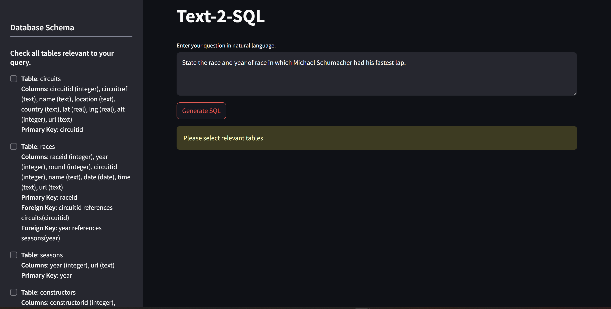
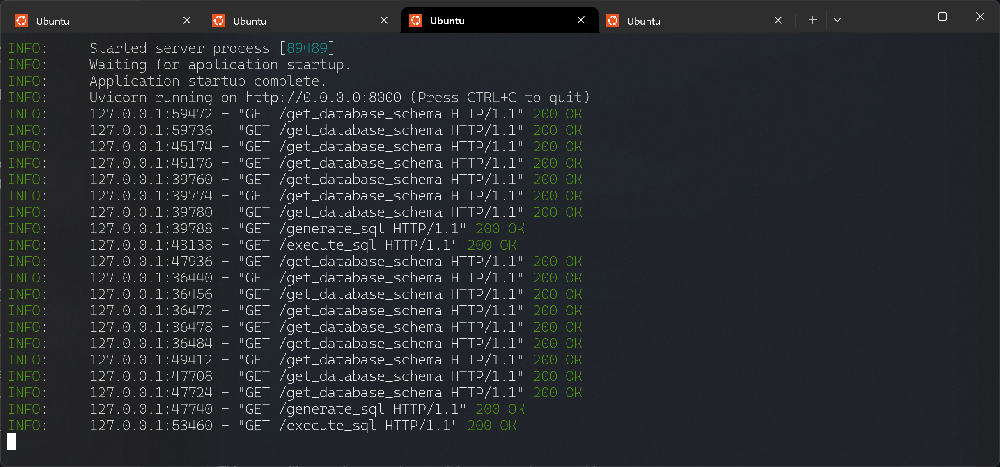
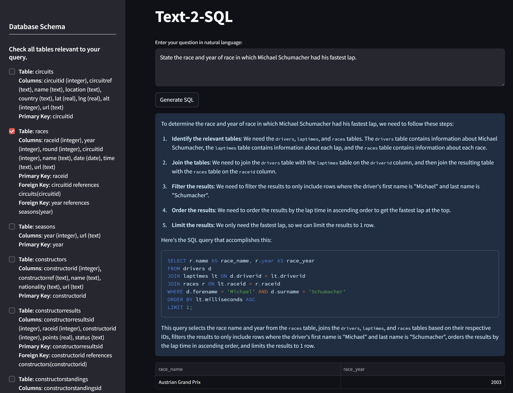

# Text2SQL-Qwen

**Text2SQL-Qwen** is a local Text-to-SQL application powered by [Qwen2.5-Coder-7B-Instruct-GPTQ-Int4](https://huggingface.co/Qwen/Qwen2.5-Coder-7B-Instruct-GPTQ-Int4). It converts natural language questions into executable SQL queries, integrates directly with **PostgreSQL**, and features a **FastAPI backend** with a **Streamlit-based UI** for interactive use.

## Features

-   Text-to-SQL using a locally hosted 7B model (GPTQ quantized)
-   PostgreSQL integration for live query execution
-   FastAPI backend for scalable and modular API development
-   Streamlit frontend for easy interaction
-   Runs completely offline after setup

---

## Setup

### 1. Clone the repository

```bash
git clone https://github.com/Vish2503/Text2SQL-Qwen.git
cd Text2SQL-Qwen
```

### 2. Set up a virtual environment using Conda (optional)

```bash
conda create -n Text2SQL-Qwen python=3.10
conda activate Text2SQL-Qwen
```

### 3. Install dependencies

```bash
pip install -r requirements.txt
```

### 4. Configure PostgreSQL

Update your `.env` file (or environment variables)

```
DB_USER
DB_PASSWORD
DB_NAME
```

Make sure PostgreSQL is running and accessible.

---

## Usage

#### NOTE: Requires around 5GB memory to load the model.

### FastAPI Backend

Start the backend server:

```bash
uvicorn model_api:app --host 0.0.0.0 --port 8000
```

API endpoints will be available at `http://0.0.0.0:8000`.

### Streamlit Frontend

Launch the UI:

```bash
streamlit run app.py
```

This opens a web interface where you can input natural language queries and see the generated SQL and results in real time.

---

## Screenshots







#### A demo video of the final product can also be found on [YouTube](https://www.youtube.com/watch?v=yFsXRy-tW6M).

---

## License

This project is licensed under the MIT License. See `LICENSE` for details.

---

## Acknowledgements

-   [Qwen2.5 by Alibaba](https://huggingface.co/Qwen)
-   [FastAPI](https://fastapi.tiangolo.com/)
-   [Streamlit](https://streamlit.io/)
-   [PostgreSQL](https://www.postgresql.org/)
